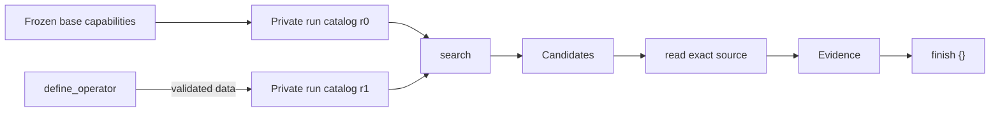

# PiMem Declarative Search Operators

Status: implemented v1 design, 2026-08-24

## 1. Decision

PiMem has three layers:

1. the Pi Agent runtime runs the retrieval reasoning loop;
2. one small Skill teaches routing and evidence discipline;
3. search operators produce Candidates from immutable history.

An Agent-created operator is **not TypeScript code**. It is a bounded,
declarative composition of already trusted search capabilities. It cannot open
files, query a database directly, read source memory, call the answer model, or
promote a Candidate to Evidence.

This keeps the public mental model small:

```text
search -> Candidates -> read -> Evidence -> finish
```

Most questions use an existing operator. When the initial catalog cannot
express a useful recall combination, the Agent may define one run-local
operator and invoke it through the same `search` tool.

## 2. Three different concepts

### 2.1 Search capability

A search capability is trusted code owned by the retrieval infrastructure.
Examples include lexical retrieval, semantic retrieval, session expansion, and
temporal retrieval. These capabilities change infrequently and are installed
by composition.

The existing `SearchOperator` interface remains the trusted execution port:

```ts
interface SearchOperator {
  readonly id: string;
  readonly version: string;
  readonly guide: SearchOperatorGuide;
  execute(
    context: SearchOperatorExecutionContext,
    input: SearchOperatorInput,
  ): Promise<SearchOperatorOutput>;
}
```

### 2.2 Operator definition

An operator definition is immutable declarative data. Internally it is a small
topologically ordered graph with two node kinds:

- `search`: run one already registered search capability;
- `combine`: merge earlier CandidateSets with `union` or reciprocal-rank
  fusion (`rrf`).

The runtime accepts at most eight nodes, four search nodes, and four inputs to
one combine node. It rejects unknown dependencies, forward references,
recursion, duplicate node IDs, invalid output nodes, and oversized graphs before
registration.

This graph is an internal domain representation. The Agent does not construct
node IDs or output edges itself.

### 2.3 Search invocation

A search invocation supplies the current query and limit to a registered
operator. It is ephemeral and question-specific. An operator definition is
reusable; the query is not stored inside that definition.

## 3. Agent-facing interface

The normal tools remain:

```text
search -> read -> finish
```

One optional tool is available for the exceptional case:

```ts
define_operator({
  id: "dual-recall",
  summary: "Fuse exact and semantic recall",
  sources: [
    { operator: "lexical", limit: 10 },
    { operator: "hybrid", limit: 10 }
  ],
  combine: "rrf"
})
```

The runtime generates graph node IDs, version, guide defaults, and output edge.
With one source, the result is a simple alias. With multiple sources, `rrf` is
the default. Duplicate sources and meaningless single-source `combine` values
are rejected. Agent-created operators may use only the catalog visible when the
run starts; they cannot nest another definition created later in the same run.

The Skill tells the Agent to prefer the initial catalog. Defining an operator
for an ordinary one-off search is explicitly discouraged. The default budget
is two declarative definitions per run.

## 4. DDD ownership

| Context | Owns | Does not own |
|---|---|---|
| `memory` | Immutable records, scopes, sessions, exact reads | Search routing or benchmark labels |
| `retrieval/model` | CandidateSet and declarative definition types | Agent tools or concrete stores |
| `retrieval/use-cases` | Definition validation, graph assembly, run catalog, candidate fusion | Prompts, citations, module loading |
| `retrieval/adapters` | Trusted executable search capabilities | Agent policy |
| `evidence-agent` | Agent tools, per-run lifecycle, Candidate-to-Evidence transition | Concrete database construction |
| `composition` | Base catalog and trusted infrastructure wiring | Runtime routing decisions |
| `benchmark` | Dataset protocol, manifests, scoring | Search semantics |

Benchmark adapters consume only the public PiMem APIs. No dataset identity,
label firewall, answer template, judge protocol, or scoring DTO is defined in
the memory, retrieval, evidence-agent, or interactive-agent contexts.

Dependencies continue to point inward:

```text
entrypoints -> composition -> adapters -> use-cases -> model
benchmark -> evidence-agent -> retrieval -> memory
```

The evidence-agent depends on the `SearchOperatorCatalog` port rather than a
concrete registry implementation. The global base registry is frozen. Each run
receives a private overlay catalog.

## 5. Lifecycle

### Before a run

Composition installs and freezes trusted code-backed capabilities. A caller may
also pass approved declarative definitions through `RunPiMemOptions`.
Preloaded definitions are validated by the same domain builder before the Agent
starts and appear in the initial catalog prompt.

### During a run

`runPiMem` forks an isolated catalog at revision zero. A successful
`define_operator` call adds one definition to that run only and increments the
catalog revision. A later `search` resolves the new ID without rebuilding the
Agent or changing its schema.

`InteractiveMemoryAgentSession` uses the same private-catalog lifecycle for a
whole environment session. This makes the capability available to
knowledge-to-action evaluations without changing their environment tools.

The base registry and sibling runs never observe the mutation.

### After a run

The result and failure diagnostics contain:

- final catalog revision and hash;
- normalized definitions;
- definition hashes and registration revisions;
- tool trace entries for definition and execution;
- per-step candidate counts for composed searches.

This is the promotion boundary. A successful definition can be reviewed,
stored as data, and passed as an approved preloaded definition to a later run.
PiMem v1 does not silently mutate a global catalog or install generated code.

## 6. Candidate and evidence boundary

`CandidateSet` is an internal retrieval value containing ranked immutable
source hits. Declarative nodes only transform CandidateSets. They never receive
an Evidence ledger capability.

Every composed search still enters the existing ledger as Candidates. Exact
source-bound `read` calls are the only way to promote them to Evidence. Each
read source is retained automatically; `finish` only closes retrieval while
the harness deduplicates sources and constructs citations.



## 7. Reproducibility and safety

- IDs, limits, graph size, and topology are validated before registration.
- A definition cannot call itself.
- The definition hash covers the normalized graph and guide.
- The catalog hash covers the frozen base catalog and ordered run definitions.
- Search execution still verifies that returned memories belong to the active
  scope.
- Definition output is navigation data and expires from active model context;
  the audit trace remains complete.
- No arbitrary code, SQL, filesystem path, package name, or network endpoint is
  accepted from the Agent.

## 8. Relation to DeepSeek Harness

The design borrows one narrow idea from DeepSeek Harness: extensions should
cross a typed service boundary, have an explicit lifecycle, and leave a
replayable event trail. PiMem does not copy an "everything is a plugin"
architecture. Its evidence kernel, immutable memory model, and trusted search
capabilities remain stable; only declarative CandidateSet composition is
run-mutable.

Reference: [DeepSeek Harness architecture](https://github.com/deepseek-ai/deepseek-harness/blob/master/docs/architecture.md)

## 9. Deliberately excluded from v1

- generated or dynamically compiled TypeScript;
- a general-purpose language or compiler;
- arbitrary predicates or embedded scripts;
- global catalog mutation during a benchmark run;
- automatic promotion of a definition without validation;
- new evidence types or a bypass around `read`;
- operator training or self-modifying retrieval code.

These exclusions are part of the method: self-extension is a constrained data
operation, not runtime source-code refactoring.
